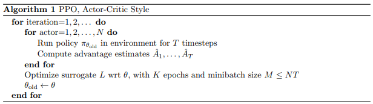
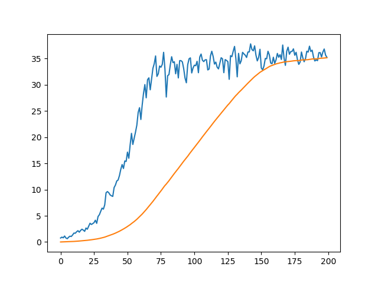
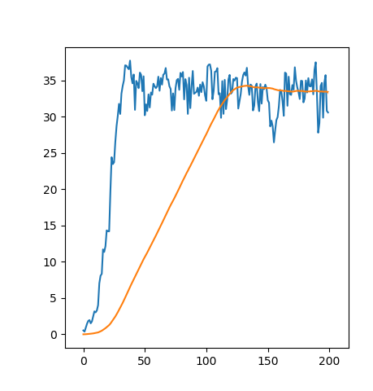

# Udacity Deep Reinforcement Learning - Continuous Control (Project 2)
## Report

In this project, the goal is to teach an agent to move a double-jointed arm to a target 
location and keep it in the target location as long as possible. The agent has access to 
the environment's 33 dimensional state, which consists of position, rotation, velocity, 
and angular velocities of the arm. Each of these 33 dimensional states takes on continuous
 values.  From this state, the agent learns which of four actions it should take. The four
  available actions are to control the torque of the two joints of the arm and are 
  continuous values between [-1,1]. The agent gets a reward of +0.1 for each step that 
  the agent's hand is in the target location. The agent is thought to have solved or 
  learned the environment when agent gets an average score of +30 over 100 consecutive 
  episodes.

---
## Algorithms
For this project I've implemented PPO and DDPG.

### DDPG
DDPG algorithm is summarised below:


**Idea (Summary)**. 

- Critic. Use neural network for Q-value function approximation as `state` -> `action` mapping with the following loss function minimised:


- Actor. Use neural network for determenistic policy approximation as `state` -> `argmax_Q` mapping with the following loss function minimised:


- Add a sample of the Ornstein–Uhlenbeck process ([link](https://en.wikipedia.org/wiki/Ornstein%E2%80%93Uhlenbeck_process)) for exploration.

### PPO
PPO algorithm is summarised below:


The Proximal Policy Optimisation method is a good alternative to DDPG for this problem.
It also shows much better results in continuous control tasks according to [benchmarks](https://arxiv.org/pdf/1604.06778.pdf).

**Idea (Summary)**

- Critic. Use neural network for value function approximation: `state` -> `value(state)`
- Actor. Use neural network for policy approximation, 
that represents value function: `state` -> `action`. 
However, the network outputs mean and standard deviation of the 
action, that is sampled from the Gaussian distribution afterwards. 
This enables exploration at the early stages of the agent training. 

**Notes and Discussion**

In vanilla PPO implementation we gather trajectories and their state-value predictions simultaniously.
Then in update step we calculate advantages using *True* Return values and *State-Value* predictions.
Thus, the schematic flow of the training is as foloows: Rollout-->State-Value Predition-->Update Critic and Actor
However, I find it more logical to update *Critic* first followed by predicting of State-Value function for gathered trajectories.
Given that the training looks like: Rollout-->Update Critic-->State-Value Prediction-->Update Actor

I have not tested this idea extensively yet. But it seems that if we first train our critic to get e batter estimate of the actor's behaivour,
then this estimation is more relyable and trustworthy for the following actor's update. 

I also found that clipping gradients in update step improve stability of the training.
One could ask a reasonable question why we need to clip the gradients if we already clipped the objective.
Seems that clipping objective already restrics our updated agent to be close to the original one.
This is partially true. In the very first update, ratio between the current policy and old one equals exactly one and 
an update could potentially drive a policy to move far away from it was before. Thus clipping of gradients is mere an
another restriction for an updated policy to stay close to an original one.

## Results:

### PPO


###DDPG


It can be seen that in both cases the environment was solved in less than 150 episodes.

To play a trained agent, run the following
> ```console
> (drlnd) $ python3 ./play.py [path to a trained agent file]
> ```
Trained agents could be found in the `models` folder.